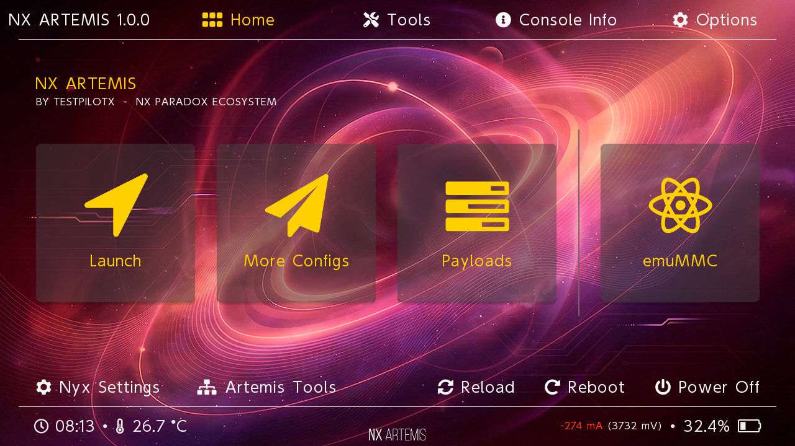
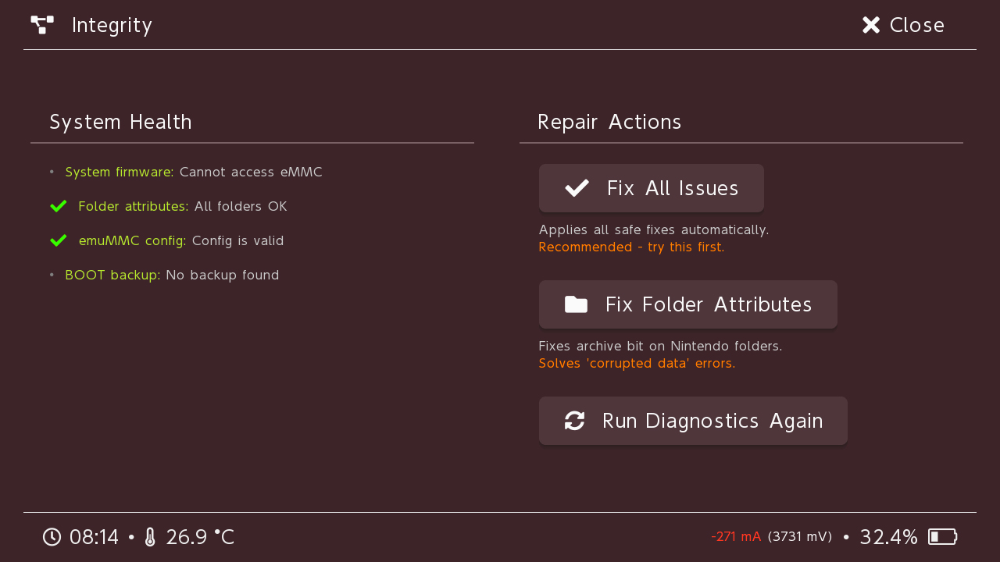
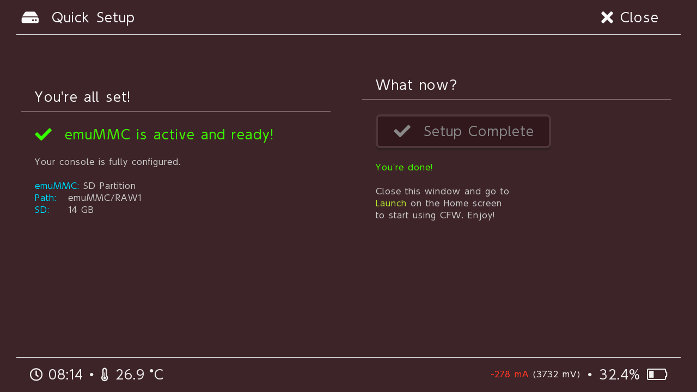

# NX ARTEMIS

**A polished fork of [hekate](https://github.com/CTCaer/hekate) with guided workflows, integrity diagnostics, and custom branding for the Switch bootloader experience.**

---

## About

**NX ARTEMIS** is a curated fork of CTCaer's hekate bootloader focused on making advanced Switch modding accessible. It keeps 100% of upstream's low-level capabilities — TegraX1 boot, payload chainloading, emuMMC, L4T, backups — and layers a small set of high-impact UX improvements on top:

- A guided **Quick Setup** wizard that walks you through partitioning your SD, creating an emuMMC, and configuring a CFW boot entry without touching a terminal.
- A built-in **Integrity** diagnostic that inspects your SD layout, boot configuration, and payload files, and offers one-click fixes for the most common misconfigurations.
- A dedicated **Artemis Tools** hub that surfaces maintenance utilities (eMMC/emuMMC checks, backup verification, recovery actions) in one place instead of scattered across menus.
- Custom branding, theming, and an embedded boot logo that cannot be tampered with from SD.

If you've ever helped a friend set up CFW and spent an hour explaining partitions, emuMMC types, and `hekate_ipl.ini` syntax, NX ARTEMIS is the distribution you wish existed.

---

## Key features

### Guided setup flow
- **Quick Setup wizard** — choose emuMMC type (file-based or partition), confirm SD sizing, and let the tool stage the operations.
- **Resume-on-crash** — the wizard persists a marker in the MBR so a failed or interrupted flow picks up exactly where it left off, even after a full SD reformat.
- **Pre-flight checks** — SD health, free space, and battery level validated before any destructive operation runs.

### Integrity diagnostics
- Static analysis of the boot configuration, payload files, and partition layout.
- Actionable error messages with "why it matters" explanations instead of cryptic codes.
- One-click remediation for fixable issues; clear escalation paths for anything that requires user judgement.

### Same hekate, better surface
- **All upstream features preserved**: CFW launcher, payload chainloader, eMMC/emuMMC management, backup & restore, L4T Linux boot, USB mass-storage, touchscreen input, Joy-Con driver.
- **Drop-in compatible** with existing `hekate_ipl.ini` configs, emuMMC setups, and payload folders.
- Upstream security fixes are merged promptly — this fork tracks hekate `master`.

### Presentation
- Embedded boot logo compiled into the binary (no `bootlogo.bmp` on SD to tamper with).
- Shipped Nyx theme (`bg=#3A292D`, hue 49) tuned to match the NX ARTEMIS visual identity.
- Renamed UI strings throughout the bootloader and GUI for a consistent brand experience.

---

## Installation

1. Download `NX_ARTEMIS_<version>.zip` from the [latest release](https://github.com/TestPilotX-Dev/NX-ARTEMIS/releases/latest).
2. Extract the archive to the **root** of your microSD card, merging with any existing Atmosphère / CFW files.
3. Inject `nx_artemis_<version>.bin` via [TegraRcmGUI](https://github.com/eliboa/TegraRcmGUI), [NXLoader](https://github.com/DavidBuchanan314/NXLoader), or any RCM payload launcher of your choice.

The first boot drops you into the NX ARTEMIS home screen. If this is a fresh SD, open **Artemis Tools → Quick Setup** to be walked through the rest.

> **Note:** NX ARTEMIS requires an unpatched (or RCM-capable) Switch. Patched units are not supported by the underlying hekate stack.

---

## Screenshots

<table>
  <tr>
    <td align="center" width="33%">
       
      <b>Home screen</b>
    </td>
    <td align="center" width="33%">
       
      <b>Quick Setup wizard</b>
    </td>
    <td align="center" width="33%">
       
      <b>Integrity diagnostics</b>
    </td>
  </tr>
</table>

---

## Compatibility

| Component          | Status                                   |
|--------------------|------------------------------------------|
| Erista (HAC-001)   | Fully supported                          |
| Mariko (HAC-001-01)| Fully supported (same as hekate)         |
| Patched units      | Not supported (hardware limitation)      |
| Atmosphère         | Works alongside; NX ARTEMIS chainloads it|
| L4T Ubuntu / Lakka | Supported via hekate's L4T launcher      |

---

## Upgrading from hekate

NX ARTEMIS is **drop-in compatible** with a hekate install. Replace the old `hekate_ctcaer_*.bin` on your SD (and in RCM injectors) with `nx_artemis_<version>.bin`, and replace the `bootloader/sys/` files from the release ZIP. Your `hekate_ipl.ini`, emuMMC, payloads, and backups are untouched.

To roll back to vanilla hekate, simply copy the upstream release over the same location.

---

## Credits

NX ARTEMIS stands entirely on the shoulders of giants.

- **[CTCaer](https://github.com/CTCaer)** and the hekate / Nyx contributors — the heavy lifting on TegraX1 boot, display, HOS/AMS integration, and the LVGL-based UI engine. NX ARTEMIS is a curation layer on top of their work, not a replacement.
- **[SciresM](https://github.com/SciresM)** and the Atmosphère team — the CFW that NX ARTEMIS is designed to launch.
- **[rajkosto](https://github.com/rajkosto)** — original BLZ decompressor used by the bootlogo pipeline.
- The LVGL project — the embedded UI framework.

---

**Made with care for the Switch homebrew community.**

[Report an issue](https://github.com/TestPilotX-Dev/NX-ARTEMIS/issues) · [Latest release](https://github.com/TestPilotX-Dev/NX-ARTEMIS/releases/latest)

